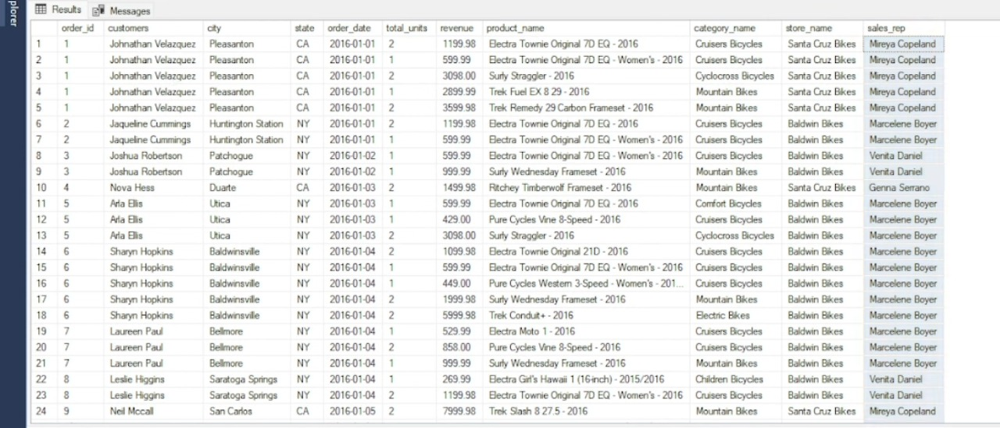
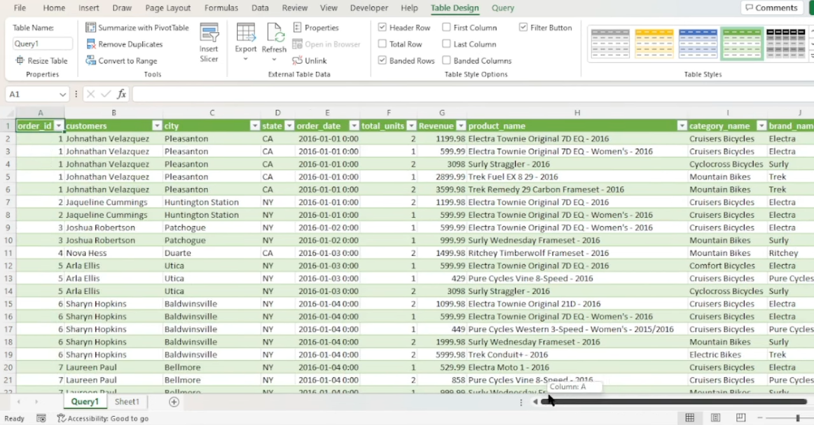
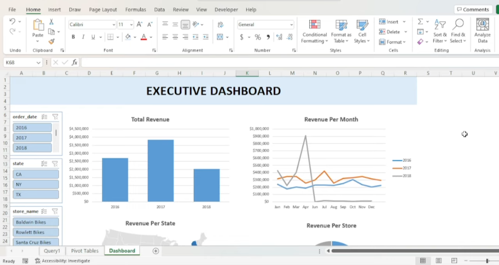
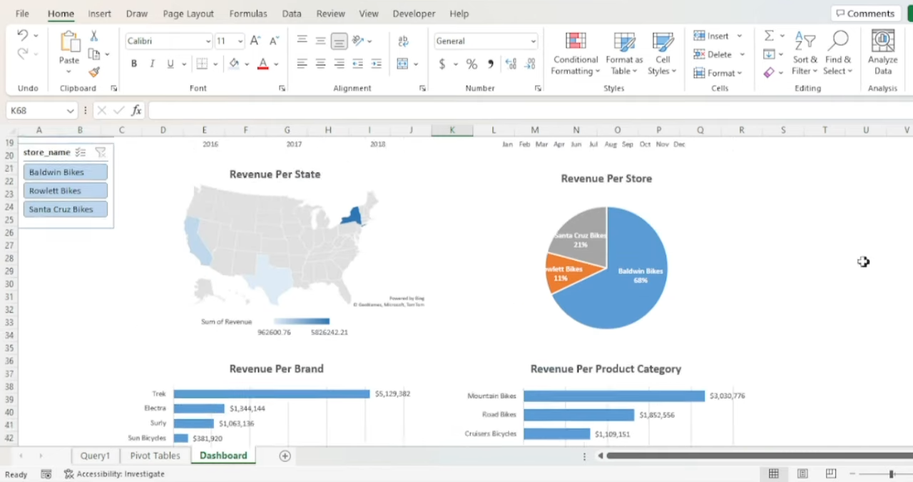
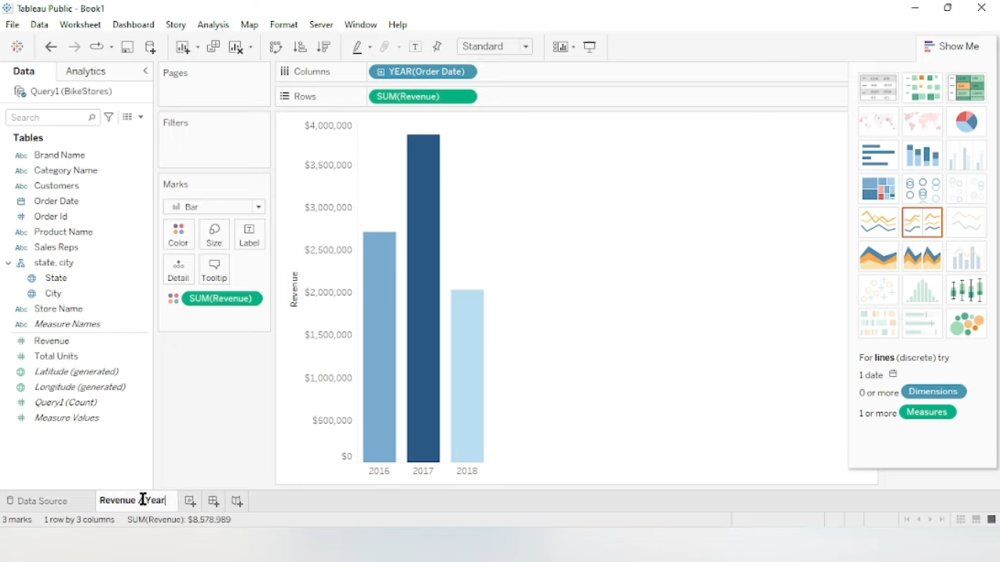
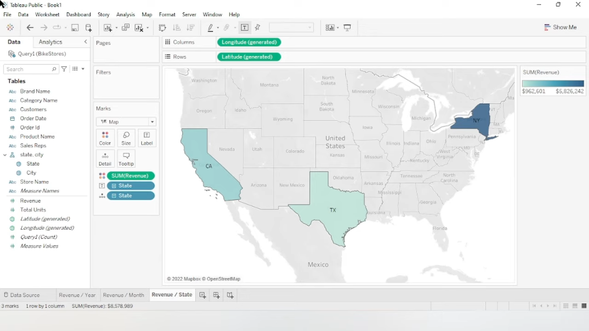
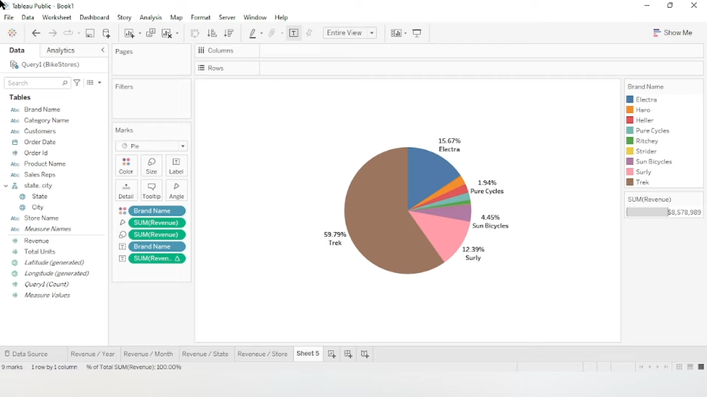
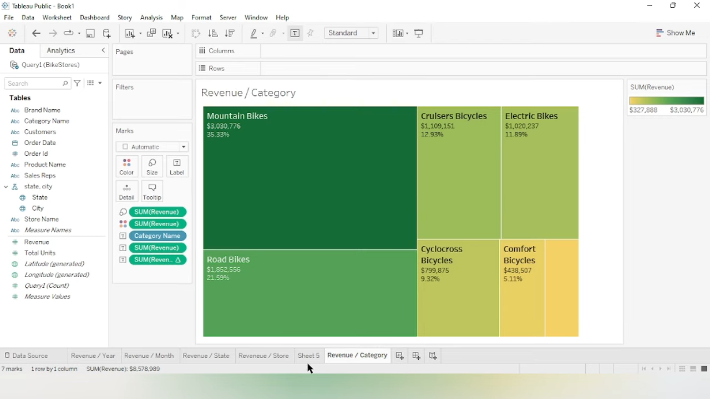
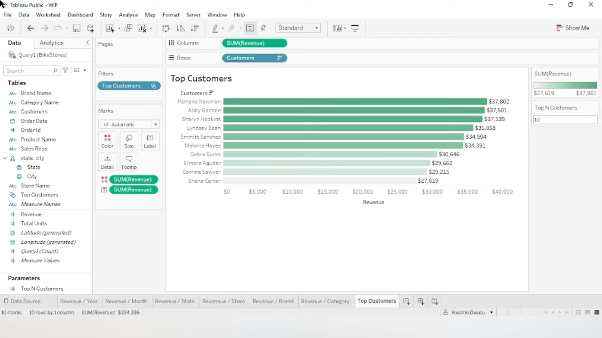

# **Comprehensive Sales Dashboard: SQL, Excel, and Tableau**
## **Overview**
This project demonstrates the end-to-end process of creating a **comprehensive sales dashboard** using **SQL, Excel, and Tableau**. The dashboard is designed to help the executive team at a **bicycle retail company** gain insights into **sales performance** from **2016 to 2018**. The primary focus is to provide key metrics such as:

- **Revenue per region, store, and brand**
- **Top customers and sales reps**
- **Sales trends over time**

Using **SQL, Excel, and Tableau**, the data is extracted, analyzed, and visualized to create an **interactive dashboard** that makes insights easily understood.

---

## **Data Analysis Steps**
The project follows the five standard steps in data analysis:

1. **Unde`rstand the Problem**  
   - Identify what insights management needs (e.g., sales trends, revenue breakdowns).
   - Determine the most effective way to present the data (dashboards vs. reports).
   
2. **Collect and Gather Data**  
   - Extract sales data from the company's **relational database** using **SQL**.
   
3. **Clean the Data**  
   - Ensure data integrity by checking for missing values, duplicates, and formatting issues.
   
4. **Explore and Analyze the Data**  
   - Generate summaries and apply **pivot tables** to analyze trends.
   
5. **Interpret Results for Insights**  
   - Use **Excel** and **Tableau** to create interactive dashboards for management.

---

## **1. SQL: Extracting the Sales Data**
To retrieve sales data, an **SQL script** is used to join multiple tables and generate a structured dataset.

### **SQL Query**
```sql
SELECT
    ord.order_id,
    CONCAT(cus.first_name, ' ', last_name) AS 'customers',
    cus.city,
    cus.state,
    ord.order_date,
    SUM(ite.quantity) AS 'total_units',
    SUM(ite.quantity * ite.list_price) AS 'revenue',
    pro.product_name,
    cat.category_name,
    sto.store_name,
    CONCAT(sta.first_name, ' ', sta.last_name) AS 'sales_rep'
FROM sales.orders ord
JOIN sales.customers cus
ON ord.customer_id = cus.customer_id
JOIN sales.order_items ite
ON ord.order_id = ite.order_id
JOIN production.products pro
ON ite.product_id = pro.product_id
JOIN production.categories cat
ON pro.category_id = cat.category_id
JOIN sales.stores sto
ON ord.store_id = sto.store_id
JOIN sales.staffs sta
ON ord.staff_id = sta.staff_id
GROUP BY
    ord.order_id,
    CONCAT(cus.first_name, ' ', last_name),
    cus.city,
    cus.state,
    ord.order_date,
    pro.product_name,
    cat.category_name,
    sto.store_name,
    CONCAT(sta.first_name, ' ', sta.last_name);
```


### **Key Data Extracted**
- Order ID, customer details, and location.
- Sales volume and revenue per order.
- Product details, store name, and sales rep information.

---

## **2. Excel: Creating an Interactive Dashboard**
### **Importing SQL Data into Excel**
- Connect Excel to the **SQL Server database** to **automate updates**.
- Load the SQL query results directly into an Excel worksheet.




### **Building Pivot Tables and Charts**
- **Revenue per year** → Clustered column chart.
- **Revenue per month** → Line chart.
- **Revenue per state** → Map chart.
- **Revenue per store** → Pie chart.
- **Revenue per brand and category** → Bar charts & Tree maps.
- **Top customers & sales reps** → Column charts.

### **Enhancing Interactivity with Slicers**
Slicers allow management to filter data dynamically by:
- **Year (2016 - 2018)**
- **State**
- **Store Name**

### **Final Touches**
- Remove gridlines and borders for a **clean, professional look**.
- Adjust fonts, colors, and layout for **easy readability**.
- Bringing it all together in an Executive Dashboard





---

## **3. Tableau: Creating an Advanced Interactive Dashboard**
### **Connecting Excel Data to Tableau**
- Import the **Excel dataset** into Tableau.
- Inspect the dataset structure to ensure **data integrity**.

### **Building Key Visualizations**
- **Revenue per Year** → Bar chart with color gradients.

- **Revenue per Month** → Line chart with a year filter.

- **Revenue per State** → Map chart with color shading.

- **Revenue per Store** → Pie chart.

- **Revenue per Brand & Category** → Tree map.

- **Top Customers & Sales Reps** → Column charts.


### **Adding Interactivity**
- **Dropdown filters** for **year and state**.
- **Action filters** allow users to **click on states or years** to dynamically update charts.
- **Calculated fields** ensure correct **singular/plural formatting** for dynamic labels.

### **Finalizing the Dashboard**
- The **executive summary banner** at the top displays:
  - **Total revenue**
  - **Number of units sold**
  - **Total orders**
  - **Unique customers**
- The **dashboard is published** to Tableau Server, allowing management to **interact with it online**.

---

## **Conclusion**
This project successfully demonstrates a **full end-to-end data analytics workflow**, covering:

**SQL** – Extracting and structuring data.  
**Excel** – Creating pivot tables, charts, and slicers for an interactive dashboard.  
**Tableau** – Enhancing visualization and interactivity with advanced filters.  

By combining these tools, the executive team can **analyze sales trends, identify top performers, and make data-driven decisions** effectively.
